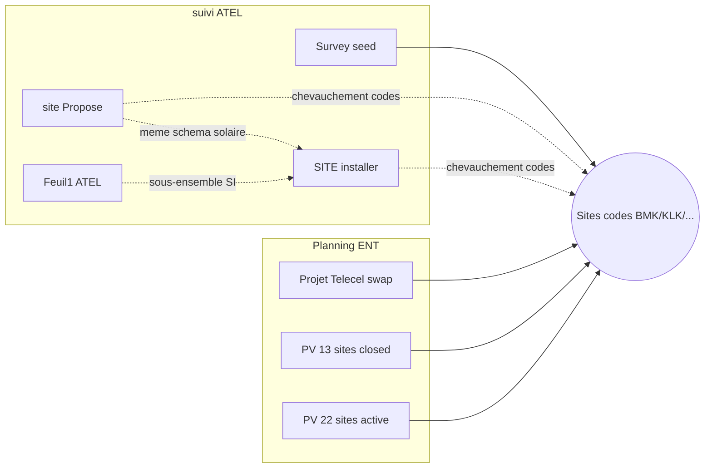

# Analyse — lien suivi ATEL vs projets Planning

Analyse uniquement (pas de seed pour les feuilles hors Survey).  
Sources : `suivi ATEL.xlsx` vs projets seedés depuis `PLaning ENT for 22sites on august.xlsx`.

## Projets Planning déjà seedés (référence)

| Projet | Code | Source | Statut |
|--------|------|--------|--------|
| Projet Telecel | `PRJ-TELECEL-SWAP` | Planning Feuil1 (lots) | pending |
| Installation de pv juillet–août 2026 | `PRJ-PV-13SITES` | Planning Feuil2 tableau 1 | completed |
| Installation de pv août–août 2026 | `PRJ-PV-22SITES` | Planning Feuil4 (maj Feuil2 T2) | active |
| Survey mise à la terre | `PRJ-SURVEY-ATEL` | suivi ATEL Survey | active |

---

## Feuille par feuille (suivi ATEL)

### Survey — seedé

Projet dédié `PRJ-SURVEY-ATEL`.  
Chevauchement de sites avec les projets Planning (ex. BMK1005, BMK1020, BMK1044, …) : **même référentiel Site**, infos survey en `informationsValues` du projet Survey (pas fusionnées dans les projets PV/swap).

`Feuil2` du même fichier = **doublon** de Survey → non seedé.

### site Propose

- Nature : candidats déploiement solaire (6/12 kW, panneaux 600 W, régulateurs Victron, `stat`).
- Lien avec Planning :
  - **Fort chevauchement de codes** avec `PRJ-PV-22SITES` / Feuil1 Telecel (ex. BMK1005, BMK1024, BMK1051, BMK1061, BMK1097, BMK1109, BMK1159, BMK1162, KLK2181, …).
  - **Pas le même objet métier** que Feuil1 (swap RRU) ni que Feuil4 (panneaux 595 W + pylône RT/GF).
  - Proche conceptuellement d’un **pipeline amont / proposition** avant ou en parallèle des installations PV Planning.
- Recommandation : projet (ou lots) ATEL « propositions » distinct, éventuellement lié aux mêmes `Site` — **pas de seed pour l’instant**.

### SITE installer

- Nature : sites marqués installés (`stat` = Done), même schéma colonnes que site Propose.
- Lien avec Planning :
  - Beaucoup de codes communs avec `PRJ-PV-22SITES` et Feuil1.
  - Liste **plus large** (~67 codes) : inclut des sites absents du planning 22 sites (ex. BMK1003, BMK1015, BMK1049, …).
  - Peut représenter le **suivi d’exécution ATEL** (installations solaires réalisées), distinct du planning ENT août (Feuil4).
- Intersection notable avec `site Propose` (presque un sous-ensemble enrichi) et avec `Feuil1` ATEL.
- Recommandation : projet « installations ATEL » ou statut d’avancement sur ProjectSite d’un projet solaire ATEL — **pas de seed pour l’instant**.

### Feuil1 (suivi ATEL)

- Nature : sous-liste ~39 sites, schéma proche (sans `stat`), panneaux 600/550 W.
- Lien : quasi **copie / extraction** de la 2ᵉ partie de `SITE installer` (mêmes codes BMK1003→BMK1149).
- Pas de lien direct structurel avec Feuil1 Planning (swap RRU) malgré le même nom de feuille.
- Recommandation : ne pas seed séparément si `SITE installer` est retenu plus tard.

---

## Synthèse des liens

| Feuille ATEL | Lien sites avec Planning | Même projet métier ? | Seed maintenant ? |
|--------------|--------------------------|----------------------|-------------------|
| Survey | Oui (codes partagés) | Non (survey terre) | **Oui** (`PRJ-SURVEY-ATEL`) |
| Feuil2 | = Survey | — | Non (doublon) |
| site Propose | Oui, fort | Fusionné ATEL solaire | **Oui** → `PRJ-ATEL-SOLAIRE` |
| SITE installer | Oui, fort + élargi | Fusionné ATEL solaire | **Oui** → `PRJ-ATEL-SOLAIRE` |
| Feuil1 | Via SITE installer | Fusionné ATEL solaire | **Oui** → `PRJ-ATEL-SOLAIRE` |

**Projet fusionné :** `PRJ-ATEL-SOLAIRE` — 75 sites uniques, statut site = le plus avancé parmi les 3 feuilles, colonne `technicien` présente mais vide.
